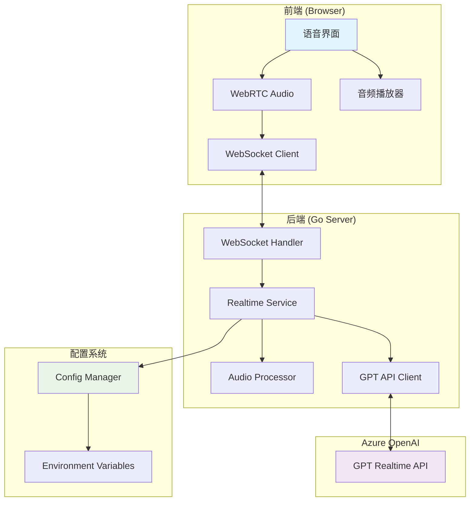
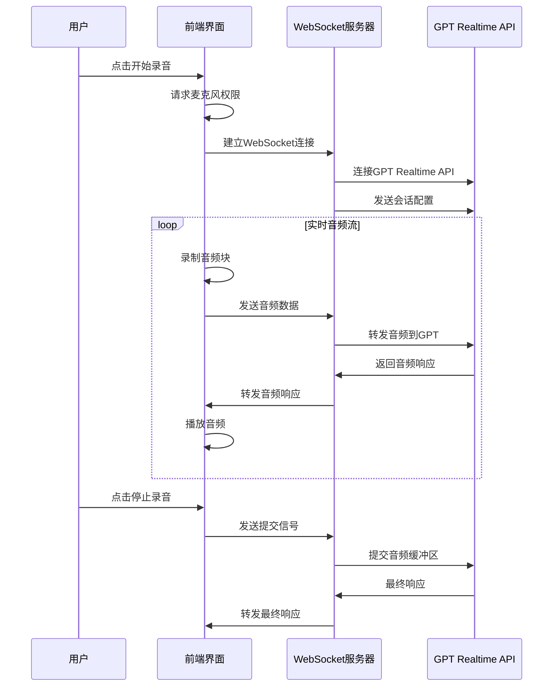

# Design Document

## Overview

本设计文档描述了在现有智能眼镜后端应用中集成 GPT Realtime API 实时语音对话功能的技术实现方案。该功能将通过 WebRTC 和 WebSocket 技术实现低延迟的语音交互，支持用户与 GPT 进行自然的语音对话。

## Architecture

### 系统架构图



### 数据流图



## Components and Interfaces

### 1. 配置管理组件 (Config Manager)

#### RealtimeConfig 结构体
```go
type RealtimeConfig struct {
    Endpoint       string `yaml:"realtime_endpoint"`
    APIKey         string `yaml:"realtime_api_key"`
    DeploymentName string `yaml:"realtime_deployment_name"`
    APIVersion     string `yaml:"realtime_api_version"`
}
```

#### 配置加载接口
```go
type ConfigLoader interface {
    LoadRealtimeConfig() (*RealtimeConfig, error)
    GetRealtimeEndpoint() string
    GetRealtimeAPIKey() string
    GetRealtimeDeployment() string
    GetRealtimeAPIVersion() string
}
```

### 2. WebSocket 处理组件 (WebSocket Handler)

#### 连接管理接口
```go
type RealtimeHandler interface {
    HandleRealtimeConnection(c *gin.Context)
    HandleClientMessages(clientConn *websocket.Conn, gptConn *websocket.Conn)
    ValidateConnection(c *gin.Context) error
}
```

#### 消息类型定义
```go
type ClientMessage struct {
    Type  string `json:"type"`
    Audio string `json:"audio,omitempty"`
}

type ServerMessage struct {
    Type  string      `json:"type"`
    Data  interface{} `json:"data,omitempty"`
    Error string      `json:"error,omitempty"`
}
```

### 3. 实时服务组件 (Realtime Service)

#### 服务接口
```go
type RealtimeService interface {
    ConnectToGPTRealtime(ctx context.Context) (*websocket.Conn, error)
    SendAudioData(conn *websocket.Conn, audioData []byte) error
    CommitAudioBuffer(conn *websocket.Conn) error
    HandleRealtimeResponse(gptConn *websocket.Conn, clientConn *websocket.Conn)
    ConfigureSession(conn *websocket.Conn) error
}
```

#### 会话配置结构
```go
type SessionConfig struct {
    Model             string                 `json:"model"`
    Modalities        []string              `json:"modalities"`
    Instructions      string                `json:"instructions"`
    Voice             string                `json:"voice"`
    InputAudioFormat  string                `json:"input_audio_format"`
    OutputAudioFormat string                `json:"output_audio_format"`
    TurnDetection     map[string]interface{} `json:"turn_detection"`
}
```

### 4. 音频处理组件 (Audio Processor)

#### 音频处理接口
```go
type AudioProcessor interface {
    DecodeBase64Audio(audioData string) ([]byte, error)
    EncodeAudioToBase64(audioData []byte) string
    ValidateAudioFormat(audioData []byte) error
    ConvertAudioFormat(input []byte, fromFormat, toFormat string) ([]byte, error)
}
```

### 5. 前端语音界面组件

#### Vue 组件接口
```typescript
interface RealtimeChat {
    // 连接管理
    connectWebSocket(): void
    disconnectWebSocket(): void
    
    // 音频控制
    startRecording(): Promise<void>
    stopRecording(): void
    playAudioResponse(audioData: string): Promise<void>
    
    // 消息处理
    handleWebSocketMessage(data: any): void
    sendAudioData(audioData: string): void
    
    // 状态管理
    updateConnectionStatus(connected: boolean): void
    updateRecordingStatus(recording: boolean): void
    updateAudioLevel(level: number): void
}
```

#### 音频配置
```typescript
interface AudioConfig {
    sampleRate: 16000
    channelCount: 1
    echoCancellation: true
    noiseSuppression: true
    autoGainControl: true
}
```

## Data Models

### 1. 音频消息模型

```go
type AudioMessage struct {
    Type      string    `json:"type"`
    Audio     string    `json:"audio,omitempty"`
    Timestamp time.Time `json:"timestamp"`
    SessionID string    `json:"session_id"`
}
```

### 2. 会话状态模型

```go
type VoiceSession struct {
    ID            string    `json:"id"`
    UserID        uuid.UUID `json:"user_id"`
    Status        string    `json:"status"` // "active", "paused", "completed"
    StartTime     time.Time `json:"start_time"`
    EndTime       *time.Time `json:"end_time,omitempty"`
    AudioDuration int64     `json:"audio_duration"` // milliseconds
}
```

### 3. 错误响应模型

```go
type ErrorResponse struct {
    Type    string `json:"type"`
    Code    string `json:"code"`
    Message string `json:"message"`
    Details string `json:"details,omitempty"`
}
```

## Correctness Properties

*A property is a characteristic or behavior that should hold true across all valid executions of a system-essentially, a formal statement about what the system should do. Properties serve as the bridge between human-readable specifications and machine-verifiable correctness guarantees.*

<function_calls>
<invoke name="prework">
<parameter name="featureName">gpt-realtime-webrtc

### Property Reflection

在分析所有可测试的接受标准后，我识别出以下需要合并或优化的属性：

**配置相关属性合并**：
- 属性 1.2-1.5 (环境变量读取) 可以合并为一个综合的配置加载属性
- 属性 4.3-4.8 (会话配置) 可以合并为一个会话配置验证属性

**响应处理属性合并**：
- 属性 5.1-5.4 (响应转发) 可以合并为一个综合的响应处理属性

**音频处理属性合并**：
- 属性 7.2-7.3 (音频参数) 可以合并为一个音频格式验证属性

**UI测试属性合并**：
- 属性 6.1, 6.4, 6.5, 6.7 (UI元素) 可以合并为一个UI组件存在性验证

经过反思，以下是优化后的正确性属性：

### Correctness Properties

**Property 1: 配置系统环境变量加载**
*For any* 环境变量配置集合，配置系统应该能够正确读取所有 Realtime API 相关的环境变量并返回有效的配置对象
**Validates: Requirements 1.2, 1.3, 1.4, 1.5**

**Property 2: 配置系统向后兼容性**
*For any* 现有的翻译服务配置，在添加 Realtime 配置后，原有配置应该保持不变且功能正常
**Validates: Requirements 1.6**

**Property 3: WebSocket Token 验证**
*For any* WebSocket 连接请求，系统应该验证 JWT Token 的有效性，拒绝无效 Token 并接受有效 Token
**Validates: Requirements 2.2, 2.3**

**Property 4: WebSocket 跨域支持**
*For any* 来自不同域的连接请求，在开发环境下应该被允许连接
**Validates: Requirements 2.4**

**Property 5: 自动 GPT API 连接**
*For any* 成功建立的 WebSocket 连接，系统应该自动建立到 GPT Realtime API 的连接
**Validates: Requirements 2.5**

**Property 6: 音频数据验证和处理**
*For any* 接收到的音频数据，系统应该验证其为有效的 Base64 格式，成功解码，并转发到 GPT API
**Validates: Requirements 3.1, 3.2, 3.3**

**Property 7: 音频处理错误恢复**
*For any* 无效的音频数据，系统应该记录错误但继续处理后续数据，不会崩溃
**Validates: Requirements 3.4**

**Property 8: 实时音频流处理**
*For any* 连续的音频数据块，系统应该能够在指定时间间隔内处理每个块
**Validates: Requirements 3.5**

**Property 9: 会话配置完整性**
*For any* GPT Realtime API 连接，系统应该发送包含所有必需配置项的会话配置消息
**Validates: Requirements 4.2, 4.3, 4.4, 4.5, 4.6, 4.7, 4.8**

**Property 10: 响应转发完整性**
*For any* 来自 GPT API 的响应（音频、文本、完成信号、错误），系统应该正确转发到对应的客户端
**Validates: Requirements 5.1, 5.2, 5.3, 5.4**

**Property 11: UI 交互响应**
*For any* 用户界面交互（点击录音按钮、接收音频响应），系统应该触发相应的行为（权限请求、音频播放）
**Validates: Requirements 6.2, 6.6**

**Property 12: UI 状态更新**
*For any* 系统状态变化（录音状态、连接状态），界面应该相应更新可视化元素
**Validates: Requirements 6.3**

**Property 13: 音频格式转换**
*For any* 输入的音频数据，转换器应该正确处理格式转换、采样率和声道配置
**Validates: Requirements 7.1, 7.2, 7.3**

**Property 14: 音频编码传输**
*For any* 需要网络传输的音频数据，系统应该使用 Base64 编码进行传输
**Validates: Requirements 7.4**

**Property 15: 音频格式错误处理**
*For any* 不支持的音频格式，转换器应该返回明确的错误信息
**Validates: Requirements 7.5**

**Property 16: 连接错误恢复**
*For any* WebSocket 连接断开或 GPT API 连接失败，系统应该尝试重连或显示适当的错误信息
**Validates: Requirements 8.1, 8.2**

**Property 17: 权限错误处理**
*For any* 麦克风权限被拒绝的情况，系统应该显示权限请求提示
**Validates: Requirements 8.3**

**Property 18: 音频播放错误恢复**
*For any* 音频播放失败，系统应该记录错误但继续处理，不影响整体功能
**Validates: Requirements 8.4**

**Property 19: 连接质量监控**
*For any* WebSocket 连接，系统应该监控连接质量并提供相关指标
**Validates: Requirements 9.5**

**Property 20: 安全认证一致性**
*For any* WebSocket 连接请求，系统应该一致地要求和验证有效的 JWT Token
**Validates: Requirements 10.1**

**Property 21: 音频数据隐私保护**
*For any* 处理的音频数据，系统应该确保不在服务器端进行持久化存储
**Validates: Requirements 10.2**

**Property 22: 会话超时管理**
*For any* 长时间无活动的语音会话，系统应该实施超时机制
**Validates: Requirements 10.4**

**Property 23: 访问日志记录**
*For any* WebSocket 连接和 API 调用，系统应该记录访问日志用于审计
**Validates: Requirements 10.5**

## Error Handling

### 错误分类和处理策略

#### 1. 连接错误
- **WebSocket 连接失败**: 显示连接错误，提供重试选项
- **GPT API 连接失败**: 记录错误日志，向用户显示服务不可用
- **网络超时**: 自动重试机制，超过阈值后提示用户

#### 2. 认证错误
- **JWT Token 无效**: 拒绝连接，返回 401 错误
- **Token 过期**: 提示用户重新登录
- **权限不足**: 返回 403 错误，记录访问尝试

#### 3. 音频处理错误
- **格式不支持**: 返回具体的格式错误信息
- **解码失败**: 记录错误，跳过当前音频块
- **播放失败**: 记录错误，继续处理后续音频

#### 4. 系统错误
- **内存不足**: 清理缓存，记录警告
- **服务过载**: 实施限流，返回 503 错误
- **配置错误**: 启动时检查，记录致命错误

### 错误恢复机制

```go
type ErrorRecovery struct {
    MaxRetries    int
    RetryInterval time.Duration
    CircuitBreaker bool
}

func (e *ErrorRecovery) HandleError(err error) RecoveryAction {
    switch err.(type) {
    case *ConnectionError:
        return RetryWithBackoff
    case *AuthenticationError:
        return FailFast
    case *AudioProcessingError:
        return ContinueProcessing
    default:
        return LogAndContinue
    }
}
```

## Testing Strategy

### 双重测试方法

本项目采用单元测试和基于属性的测试相结合的方法：

- **单元测试**: 验证具体示例、边界情况和错误条件
- **基于属性的测试**: 验证跨所有输入的通用属性
- 两者互补，提供全面的测试覆盖

### 单元测试重点

单元测试专注于：
- 具体的配置加载示例
- WebSocket 连接的集成点
- 音频格式转换的边界情况
- 错误处理的特定场景

### 基于属性的测试配置

- **测试库**: 使用 Go 的 `testing/quick` 包或第三方库如 `gopter`
- **最小迭代次数**: 每个属性测试至少 100 次迭代
- **测试标记格式**: **Feature: gpt-realtime-webrtc, Property {number}: {property_text}**

### 测试实现示例

```go
// Property 1: 配置系统环境变量加载
func TestConfigEnvironmentVariableLoading(t *testing.T) {
    // Feature: gpt-realtime-webrtc, Property 1: 配置系统环境变量加载
    
    property := func(endpoint, apiKey, deployment, version string) bool {
        // 设置环境变量
        os.Setenv("AZURE_OPENAI_REALTIME_ENDPOINT", endpoint)
        os.Setenv("AZURE_OPENAI_REALTIME_API_KEY", apiKey)
        os.Setenv("AZURE_OPENAI_REALTIME_DEPLOYMENT_NAME", deployment)
        os.Setenv("AZURE_OPENAI_REALTIME_API_VERSION", version)
        
        // 加载配置
        config, err := LoadRealtimeConfig()
        if err != nil {
            return false
        }
        
        // 验证配置正确性
        return config.Endpoint == endpoint &&
               config.APIKey == apiKey &&
               config.DeploymentName == deployment &&
               config.APIVersion == version
    }
    
    if err := quick.Check(property, &quick.Config{MaxCount: 100}); err != nil {
        t.Error(err)
    }
}
```

### 前端测试策略

#### Vue 组件测试
- 使用 Vue Test Utils 进行组件单元测试
- 使用 Jest 进行 JavaScript 逻辑测试
- 使用 Cypress 进行端到端测试

#### WebRTC 测试
- 模拟 MediaDevices API
- 测试音频流处理逻辑
- 验证 WebSocket 消息处理

### 集成测试

#### WebSocket 集成测试
```go
func TestWebSocketIntegration(t *testing.T) {
    // 启动测试服务器
    server := httptest.NewServer(setupRouter())
    defer server.Close()
    
    // 建立 WebSocket 连接
    wsURL := "ws" + strings.TrimPrefix(server.URL, "http") + "/api/v1/realtime/chat"
    conn, _, err := websocket.DefaultDialer.Dial(wsURL, nil)
    require.NoError(t, err)
    defer conn.Close()
    
    // 测试音频数据发送和接收
    audioData := generateTestAudioData()
    err = conn.WriteJSON(ClientMessage{
        Type:  "audio_data",
        Audio: base64.StdEncoding.EncodeToString(audioData),
    })
    require.NoError(t, err)
    
    // 验证响应
    var response ServerMessage
    err = conn.ReadJSON(&response)
    require.NoError(t, err)
    assert.Equal(t, "audio_response", response.Type)
}
```

### 性能测试

#### 延迟测试
- 测量音频处理延迟
- 监控 WebSocket 消息传输时间
- 验证实时性要求

#### 负载测试
- 并发 WebSocket 连接测试
- 音频流处理压力测试
- 内存使用监控

### 测试数据生成

#### 音频数据生成器
```go
func GenerateTestAudioData(duration time.Duration, sampleRate int) []byte {
    samples := int(duration.Seconds() * float64(sampleRate))
    data := make([]byte, samples*2) // 16-bit samples
    
    for i := 0; i < samples; i++ {
        // 生成正弦波测试音频
        sample := int16(math.Sin(2*math.Pi*440*float64(i)/float64(sampleRate)) * 32767)
        binary.LittleEndian.PutUint16(data[i*2:], uint16(sample))
    }
    
    return data
}
```

#### 配置数据生成器
```go
func GenerateTestConfig() RealtimeConfig {
    return RealtimeConfig{
        Endpoint:       "https://test-" + randomString(10) + ".openai.azure.com/",
        APIKey:         randomString(32),
        DeploymentName: "gpt-4o-realtime-preview",
        APIVersion:     "2024-10-01-preview",
    }
}
```